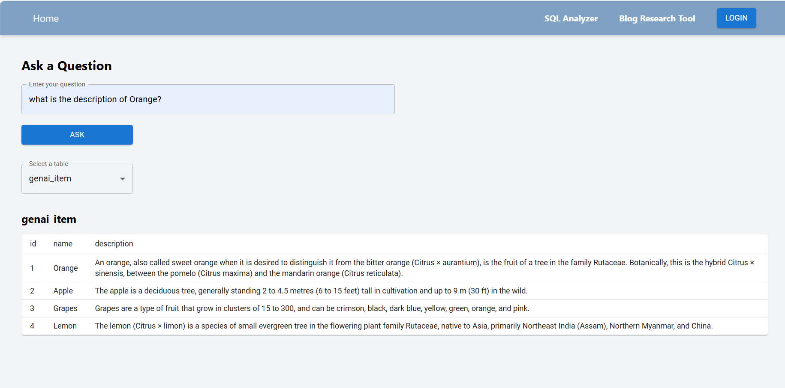
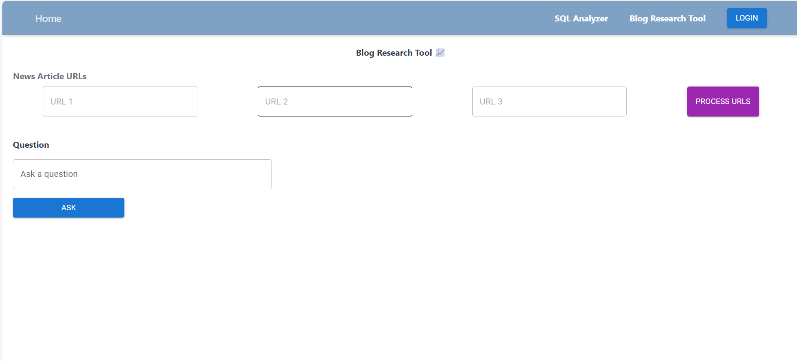

## README for Gen AI Tools Application

### Table of Contents
1. [Overview](#overview)
2. [Features](#features)
3. [Technologies](#technologies)
4. [Setup Instructions](#setup-instructions)
5. [Usage](#usage)
6. [Screenshots](#screenshots)
7. [Contributing](#contributing)
8. [License](#license)

---

## Overview

The Gen AI Tools application is a powerful suite that includes tools like an SQL Database Analyzer and a Blog Research Tool. It leverages modern technologies to provide an efficient and user-friendly experience.

## Features

- **SQL Database Analyzer**: Query and analyze your SQL databases using natural language.
- **Blog Research Tool**: Perform research and gather insights for blog content.
- **Responsive Design**: Fully responsive interface using Tailwind CSS.
- **Material UI**: Enhanced UI components for a better user experience.

## Technologies

### Frontend
- React
- TypeScript
- Tailwind CSS
- Material UI

### Backend
- Django
- OpenAI
- Langchain
- PaLM 2
- Django REST framework
- SQLite (or other SQL databases)

## Setup Instructions

### Prerequisites

- Node.js (v12 or later)
- Python (v3.6 or later)
- Django (v3 or later)
- SQLite (or another SQL database)

### Frontend Setup

1. **Clone the repository:**
   ```bash
   git clone https://github.com/At0mSsS-Cyber/Gen-AI-Client.git
   cd Gen-AI-Client
   ```

2. **Install dependencies:**
   ```bash
   npm install
   ```

3. **Start the development server:**
   ```bash
   npm start
   ```

### Backend Setup

1. **Clone the repository:**
   ```bash
   git clone https://github.com/At0mSsS-Cyber/Gen-AI-Server.git
   cd Gen-AI-Server
   ```

2. **Create a virtual environment and activate it:**
   ```bash
   python -m venv venv
   source venv/bin/activate  # On Windows, use `venv\Scripts\activate`
   ```

3. **Install dependencies:**
   ```bash
   pip install -r requirements.txt
   ```

4. **Run database migrations:**
   ```bash
   python manage.py migrate
   ```

5. **Start the development server:**
   ```bash
   python manage.py runserver
   ```

## Usage

### Frontend

Once the frontend server is running, open your browser and navigate to `http://localhost:3000`. You can use the SQL Database Analyzer to connect to your database and perform queries. The Blog Research Tool allows you to search for blog topics and gather insights.

### Backend

The backend server runs at `http://localhost:8000`. It provides RESTful APIs for the frontend to interact with the SQL database and other services.

### Example Requests

**List Tables**
```bash
curl -X GET http://localhost:8000/api/tables/
```

**Execute Query**
```bash
curl -X POST http://localhost:8000/api/query/ -d '{"query": "SELECT * FROM your_table"}' -H "Content-Type: application/json"
```

## Screenshots

### SQL Database Analyzer


### Blog Research Tool


## Contributing

We welcome contributions to enhance the features and functionality of this application. Please follow these steps:

1. Fork the repository.
2. Create a new branch (`git checkout -b feature/your-feature-name`).
3. Commit your changes (`git commit -m 'Add some feature'`).
4. Push to the branch (`git push origin feature/your-feature-name`).
5. Open a pull request.

## License

This project is licensed under the MIT License. See the [LICENSE](LICENSE) file for more details.

---
